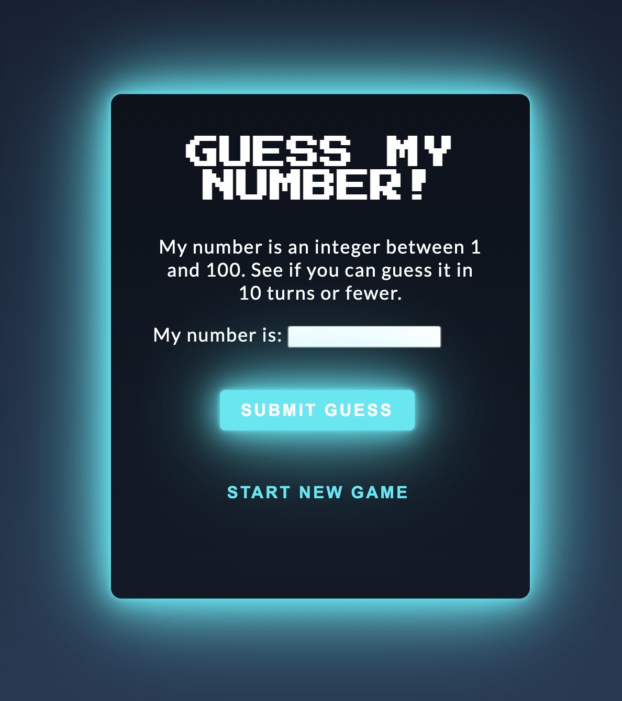

# Guess My Number

## Live version: [Link](https://guess-my-number-blue.vercel.app/)

## Description 
A number guessing game 

## Built with
HTML5;
CSS:
- Import fonts from Google Fonts;
- CSS box-model;
- Pseudo-elements;
- Gradients.

## Developer experience (JS)
- practiced DOM manipulation: modified classlists, selected, enabled/disabled, placed focus on, retrieved values from, modified contents of, changed colors of DOM elements
- used JS Math object to get random real values and to round them down to integer values;
- practiced using functions to cut the code down into little pieces in order to follow the KISS and DRY principles, and to make the code much more readable;
- practiced using state functions;
- practiced using boolean variables in order to make the code modification easier and to significantly improve readability;
- practiced placing parameter validity guards to catch possible bugs;
- practiced using JS-specific template literal feature
- practiced replacing nested if-else statements by function returns, resulting in much simpler code;
- practiced using ternary operator to keep the code cleaner;
- practiced using the for..of loop; 

## Features
- Interactive user interface: 
Buttons have bright, colorful, addictive hover animations - they make you want to press them
Similarly styled background glow also serves as a subtle feedback tool for the user: when the user wins it glows green and when the user fails to guess right it glows red
- Handpicked fonts which enhance the look of the game
- A direct textual feedback bar to the user on their guess attempt: it tells the user whether the result of their attempt was a success or a failure and changes color accordingly; It also tells user whether their guess was too low or too high;
- The game keeps track of previous guesses user made and displays them for convenience
- The game can be restarted at any moment using the "START NEW GAME" button
- The game tells user if their input was invalid
